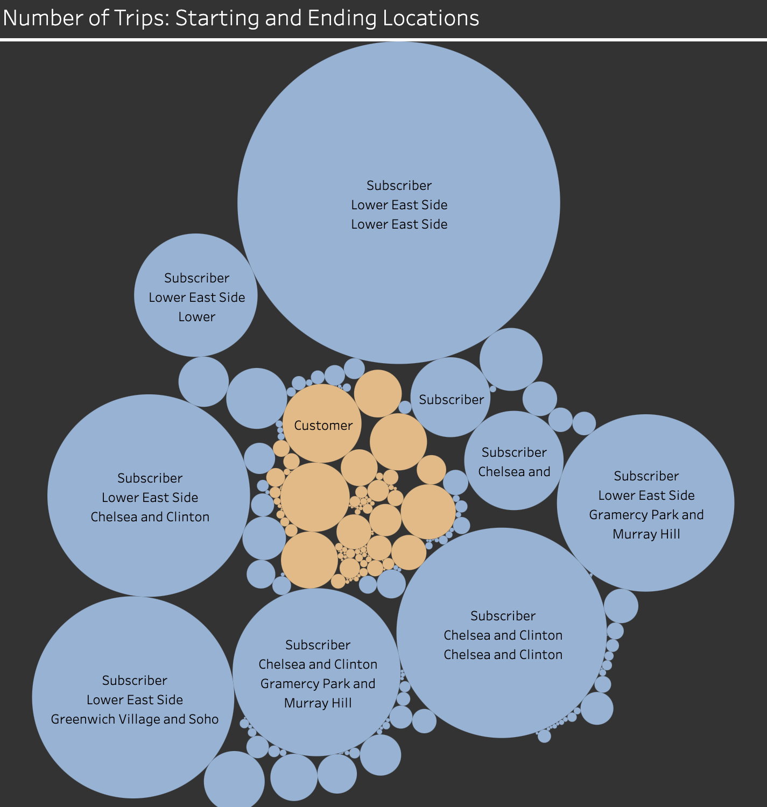

# Executive Summary: Cyclistic
Cyclistic, a bike-sharing company, sought insights into how their bikes were being used to inform future expansion plans for bike-riding locations. Although the company provided a dataset, it lacked some information necessary for a comprehensive analysis. However, by refining the available data, we were able to extract relevant metrics and dimensions. These insights were then presented through a [dashboard](https://public.tableau.com/views/CyclisticBikeShare_17356144663650/CyclisticBikeShare?:language=en-GB&:sid=&:redirect=auth&:display_count=n&:origin=viz_share_link) to assist Cyclistic in making informed decisions.

## Techniques Used
- Extract, Transform and Load the dataset with SQL and BigQuery
- Data Cleaning
- Data Transformation
- Data Analysis
- Data Visualisation and Dashbiard Development with Tableau

## Key Metrics
There were two main metric used in the project: number of ride minutes and the number of ride counts. These metric provided crucial insights into how the bikes were being used by diffrent users, seasons, and locations.

## Main Findings
The two most interesting facts were that users ride more frequently during the Fall season and the Lower East-side has the highest end-locations out of all the location provided. 

[Completed Dashboard](https://public.tableau.com/views/CyclisticBikeShare_17356144663650/CyclisticBikeShare?:language=en-GB&:sid=&:redirect=auth&:display_count=n&:origin=viz_share_link)

